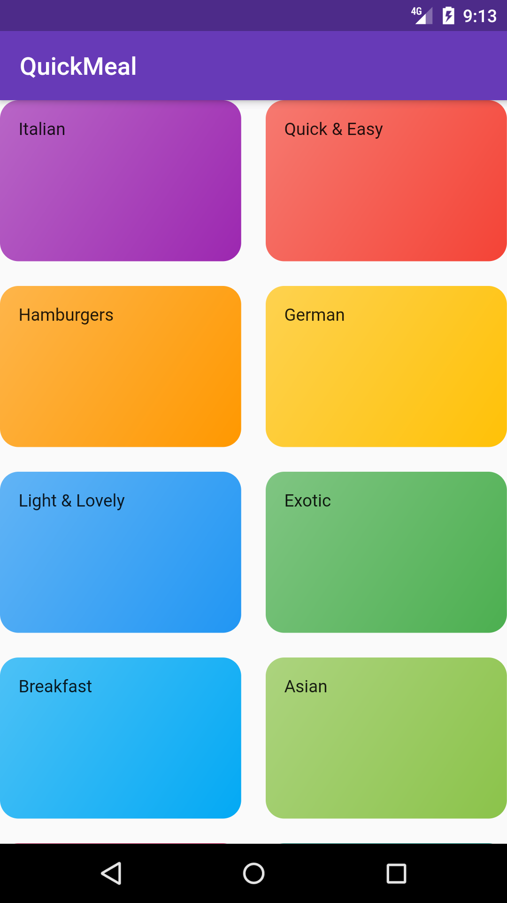
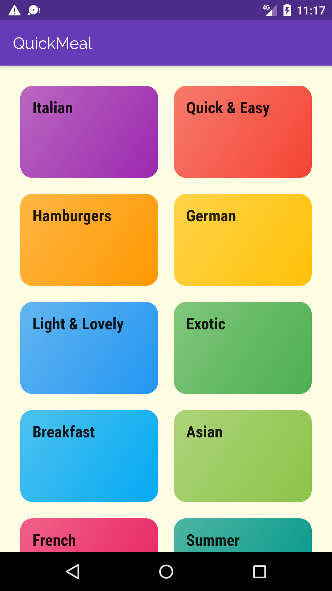
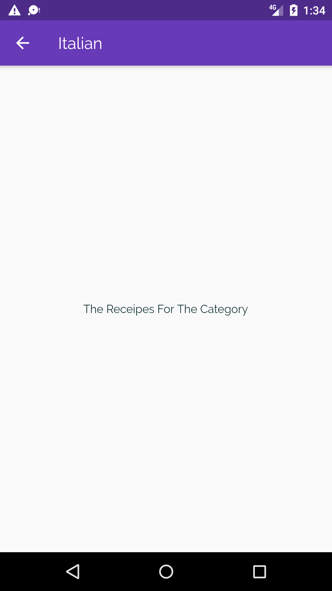
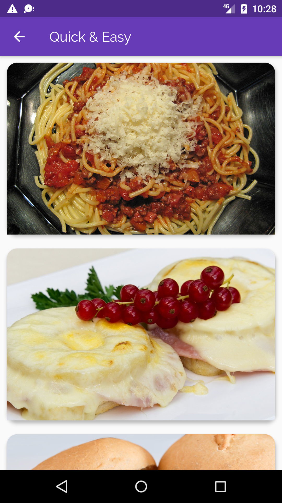
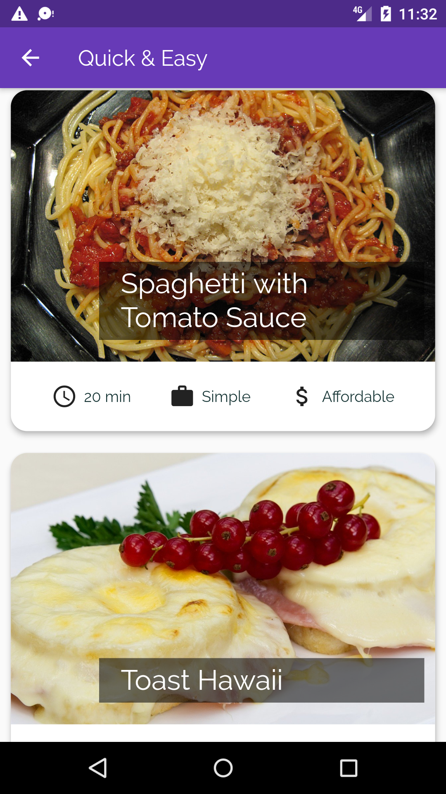
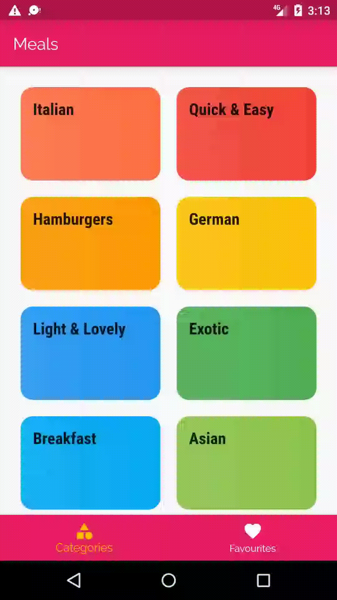

# QuickMeal
QuickMeal is an application, which is what I've developed during my flutter learning phase. Special thanks to Mr.Schwarzmüller for
making flutter easier for us.

## Application Planning

We will have more than one screen. In our appBar we need a hamburger icon to open the side-drawer onTap. We will have links to
different screens to navigate (Meals, Settings). Meals is the default page containing meal categories. In the default page we will
have a tab to switch between all meal categories and favourite meals. 

When we press one of the categories, then a new screen will show meals of that selected category. When we tap on a meal,
then we will have a new screen showing the details(image, ingredients, steps to create the dish) of that meals. In our settings, page we can take user choice of which type of meals they want to see (veg, non-veg) etc. In our favourite screen,
we will only see our favourite meals.

# Different Stages

Stage (1)             |  Stage (2)             | Stage (3)            | Stage (4)                   
:-------------------------:|:-------------------------:|:-------------------------:|:-------------------------:
|   |    |  |  |
Stage (5)             |  Stage (6)             | Stage (7)            | Stage (8)                   
:-------------------------:|:-------------------------:|:-------------------------:|:-------------------------:
|   |   |   |   |

